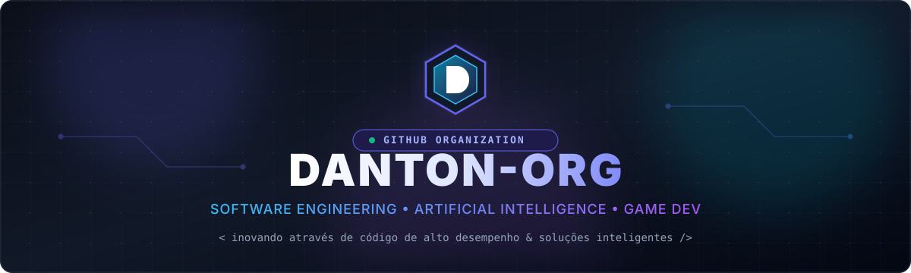
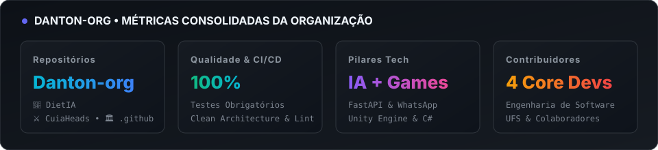

# Danton.org

<div align="center">

  

  <br/><br/>

  <a href="https://github.com/Danton-org">
    
  </a>

  <br/><br/>

  <!-- Status Badges -->
  <a href="https://github.com/Danton-org">
    
  </a>
  <a href="https://github.com/Danton-org">
    
  </a>
  <a href="https://github.com/Danton-org">
    
  </a>
  <a href="https://github.com/Danton-org">
    
  </a>

</div>

---

### 🌐 Sobre a Danton.org

A **Danton.org** é uma organização de tecnologia focada na concepção, pesquisa e desenvolvimento de soluções de software modernas, inteligência artificial aplicada e experiências interativas em desenvolvimento de jogos.

Nossos projetos combinam **engenharia de software orientada a dados**, **arquitetura limpa**, automação avançada e excelência técnica para entregar ferramentas escaláveis e produtos que transformam ideias em impacto real.

#### 🧭 Nossos Pilares de Atuação

<table>
  <tr>
    <td width="33%" align="center">
      <h3>🧠 Inteligência Artificial & Saúde</h3>
      <p>Desenvolvimento de plataformas inteligentes como o <b>DietIA</b>, integrando modelos preditivos, automação via WhatsApp, mensageria e processamento nutricional orientado por IA.</p>
    </td>
    <td width="33%" align="center">
      <h3>🎮 Desenvolvimento de Jogos</h3>
      <p>Criação de jogos de ação e combate como o <b>CuiaHeads</b>, com combate acelerado, física aplicada, animações fluidas e sistemas modulares em Unity Engine.</p>
    </td>
    <td width="33%" align="center">
      <h3>⚡ Engenharia & Qualidade</h3>
      <p>Adoção rigorosa de boas práticas: <b>Clean Architecture</b>, microsserviços em FastAPI, containerização com Docker, testes de CI automatizados e integração contínua.</p>
    </td>
  </tr>
</table>

---

### 📊 Métricas & Estatísticas da Organização

<div align="center">

  

  <br/><br/>

  <table>
    <tr>
      <th align="center">Dimensão</th>
      <th align="center">Métrica</th>
      <th align="center">Status & Padrão</th>
    </tr>
    <tr>
      <td><b>Repositórios Centrais</b></td>
      <td><code>DietIA</code> • <code>CuiaHeads-Overpowered-Game</code> • <code>.github</code></td>
      <td>🚀 Ativos & Em Desenvolvimento</td>
    </tr>
    <tr>
      <td><b>Testes & CI/CD</b></td>
      <td>Testes locais obrigatórios antes de qualquer commit</td>
      <td>✅ 100% de Aprovação</td>
    </tr>
    <tr>
      <td><b>Arquitetura</b></td>
      <td>Clean Architecture, Microsserviços e Separação de Domínios</td>
      <td>🏛️ Modular & Escalável</td>
    </tr>
    <tr>
      <td><b>Core Team</b></td>
      <td>4 Engenheiros de Software e Game Developers</td>
      <td>👥 Ativos & Colaborativos</td>
    </tr>
  </table>

</div>

---

### 🚀 Projetos Oficiais da Danton-org

Todos os repositórios oficiais mantidos e desenvolvidos sob o escopo da organização **Danton-org**:

| Repositório | Descrição Detalhada | Tecnologias Chave | Status |
| :--- | :--- | :--- | :---: |
| [**🍏 Danton-org/DietIA**](https://github.com/Danton-org/DietIA) | **Plataforma Inteligente de Nutrição & Saúde com IA**.<br/>Sistema autônomo com agendador de hidratação e refeições, mensageria via WhatsApp, autenticação robusta (JWT & OTP), geração de planos dietéticos assistidos por IA e arquitetura moderna em microsserviços. | `Python` `FastAPI` `Docker` `PostgreSQL` `Redis` `WhatsApp API` |  |
| [**⚔️ Danton-org/CuiaHeads-Overpowered-Game**](https://github.com/Danton-org/CuiaHeads-Overpowered-Game) | **Jogo Dinâmico de Ação e Combate em Arena**.<br/>Desenvolvido na Unity Engine, conta com sistema dinâmico de buffs/debuffs, animações de combate personalizadas, controladores responsivos e combate em tempo real. | `Unity` `C#` `HLSL` `New Input System` |  |
| [**🏛️ Danton-org/.github**](https://github.com/Danton-org/.github) | **Governança, CI/CD & Perfil da Organização**.<br/>Central de padronização, automações via GitHub Actions, documentação de governança, templates e apresentação oficial do perfil da organização. | `GitHub Actions` `Markdown` `CI/CD` `Python` `Pytest` |  |

---

### 👥 Contribuidores & Membros Mais Ativos

O time principal e desenvolvedores que constroem ativamente as soluções da **Danton.org**:

<div align="center">

<table>
  <tr>
    <td align="center" width="25%">
      <a href="https://github.com/BrunoDanton">
        <br />
        <sub><b>Bruno Danton</b></sub>
      </a>
      <br />
      <span title="Founder & Lead Architect">👑 <b>Lead & Founder</b></span>
      <br />
      <sub>Engenharia de Software, Backend, Unity & IA</sub>
      <br /><br />
      <a href="https://github.com/BrunoDanton">
        
      </a>
    </td>
    <td align="center" width="25%">
      <a href="https://github.com/gbr-ufs">
        <br />
        <sub><b>Gabriel Santos de Souza</b></sub>
      </a>
      <br />
      <span title="Core Software Engineer">🚀 <b>Core Engineer</b></span>
      <br />
      <sub>Backend, Automação, Scheluding, Testes & DevOps</sub>
      <br /><br />
      <a href="https://github.com/gbr-ufs">
        
      </a>
    </td>
    <td align="center" width="25%">
      <a href="https://github.com/everto-API">
        <br />
        <sub><b>Everton Carlos</b></sub>
      </a>
      <br />
      <span title="Game Developer">⚔️ <b>Game Developer</b></span>
      <br />
      <sub>Game Systems, Lógica de Combate, Matemática Aplicada</sub>
      <br /><br />
      <a href="https://github.com/everto-API">
        
      </a>
    </td>
    <td align="center" width="25%">
      <a href="https://github.com/DavissonC">
        <br />
        <sub><b>Dávisson Cavalcante</b></sub>
      </a>
      <br />
      <span title="Software Engineer">💡 <b>Collaborator</b></span>
      <br />
      <sub>Engenharia de Software, Full Stack & Integrações</sub>
      <br /><br />
      <a href="https://github.com/DavissonC">
        
      </a>
    </td>
  </tr>
</table>

</div>

---

### 🛠️ Stack Tecnológica & Ecossistema

<div align="center">

#### Backend & Inteligência Artificial


<br/>

#### Game Development & Computação Gráfica


<br/>

#### DevOps, Qualidade & Ferramentas


</div>

---

### 🛡️ Padrões de Engenharia & Qualidade (CI/CD)

Na **Danton.org**, prezamos pela sustentabilidade e confiabilidade do nosso código. Nossos repositórios seguem princípios sólidos de governança de software:

- **🧪 Testes de CI Obrigatórios**: Antes de efetuar qualquer `git commit` ou aprovar pull requests, todos os testes unitários e de integração de CI devem ser executados localmente e passar com 100% de sucesso.
- **🏛️ Arquitetura Limpa (Clean Architecture)**: Isolamento estrito de domínios, entidades, casos de uso e adaptadores externos (banco, mensageria, gateways).
- **📝 Conventional Commits**: Padrão semântico claro para histórico de versões legível (`feat`, `fix`, `refactor`, `docs`, `test`, `chore`).
- **🔍 Revisão por Pares (Code Review)**: Garantia de qualidade, clareza e compartilhamento de conhecimento em cada contribuição.

---

### 🤝 Como Contribuir

Contribuições de código, sugestões, relatórios de bugs e melhorias são sempre bem-vindos!

1. **Faça um Fork** do projeto oficial da Danton-org que deseja contribuir.
2. **Crie uma branch** para sua funcionalidade ou correção:
   ```bash
   git checkout -b feature/minha-nova-funcionalidade
   ```
3. **Desenvolva e garanta os testes**:
   ```bash
   # Execute os testes de CI locais e garanta que passem!
   pytest
   ```
4. **Faça o Commit** seguindo as convenções:
   ```bash
   git commit -m "feat: adiciona nova funcionalidade incrível"
   ```
5. **Faça o Push** e abra um **Pull Request**.

---

### 📫 Conecte-se com a Danton.org

- 🏢 **GitHub Org**: [github.com/Danton-org](https://github.com/Danton-org)
- 👤 **Founder**: [@BrunoDanton](https://github.com/BrunoDanton)
- 💬 **Discussions & Issues**: Sinta-se à vontade para abrir uma issue nos nossos repositórios públicos para dúvidas, sugestões ou parcerias!

<br />

<div align="center">
  <sub>Feito com dedicação e café por toda a equipe da <b>Danton.org</b> 🚀</sub>
</div>
